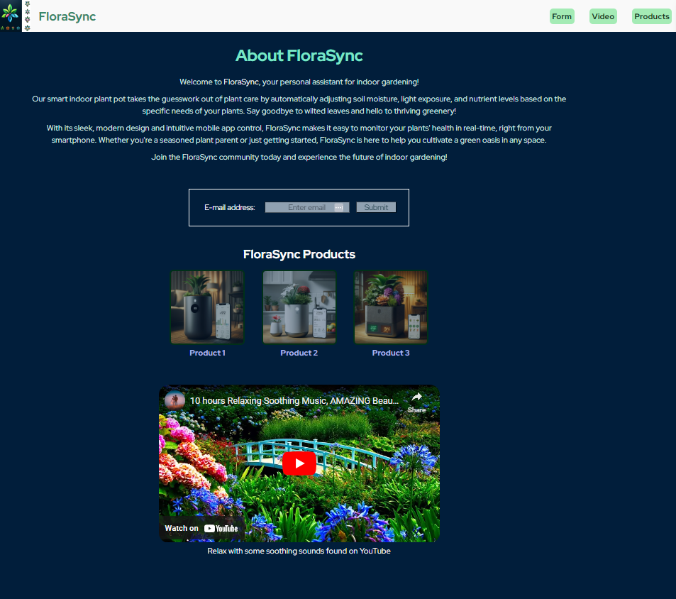

# FloraSync Landing Page

This repository was created to store project files for FloraSync, a landing page created as a result of the [freeCodeCamp Design Certification](https://www.freecodecamp.org/learn/2022/responsive-web-design/).

## Viewing the Project

To view this project locally, follow these steps:

1. Clone this respository.
2. Open the project directory in your code editor.
3. Use a development server to view your project. LiveServer was used during the duration of this project.
   * You can download LiveServer via npm:
     * `npm install -g live-server`
   * Navigate to this project directory in your terminal and start LiveServer with:
     * `live-server`
4. The project should automatically open in your default web browser.

## Utilizations

This code comprises a product landing page for "FloraSync," a smart indoor gardening assistant. It features four main sections of code: a fixed navigation bar at the top, a text description section, a simple form for collecting email addresses, a showcase of FloraSync products with descriptions on hover, and a video section for additional information. The design is modern with a color scheme emphasizing greens, purples, and whites, complemented by a responsive layout for various devices. The page aims to introduce users to FloraSync's features and benefits, encouraging them to join the community and explore indoor gardening possibilities.

*Note: This is not a real product.*

## Project Structure

- **HTML File:** index.html
- **CSS File:** styles.css
- **img**: This is where the images used in the project are stored.

Feel free to leaf through and enjoy this project!

## What you should see:

